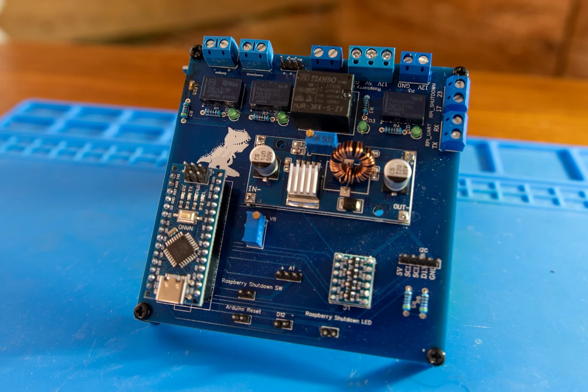

# ups_controller

It's just my UPS controller on Arduino for Internet Router + RaspberryPi

[EasyEda](https://easyeda.com/editor#project_id=0bf0c4ab24b245bfa950abd184b83c0f)

[Blog](https://wampi.re/village_ups)
